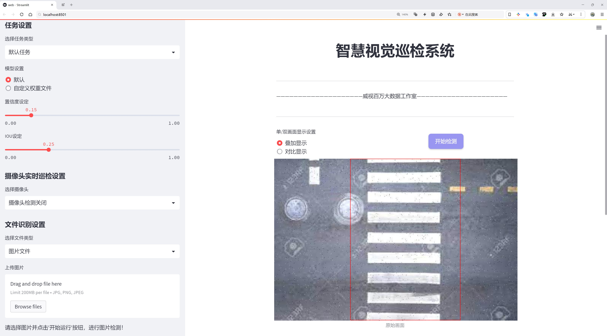
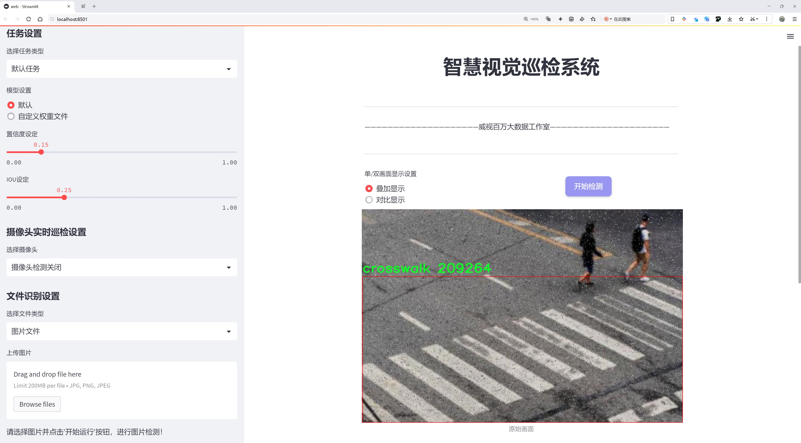
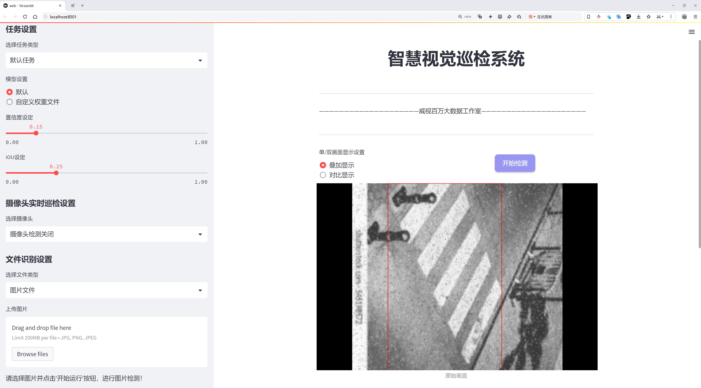
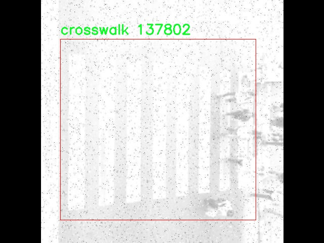
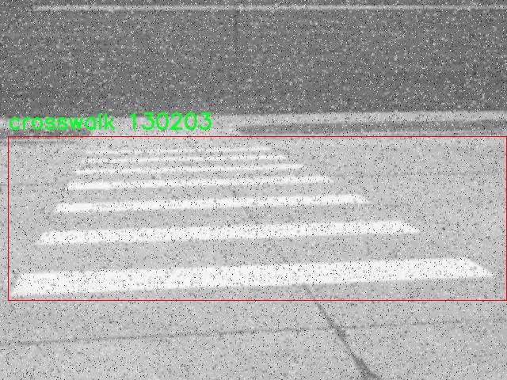
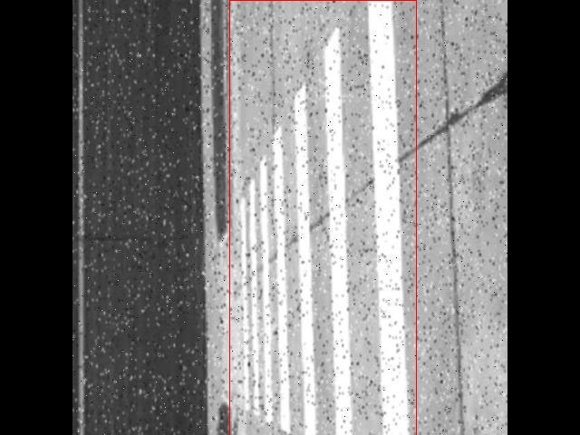
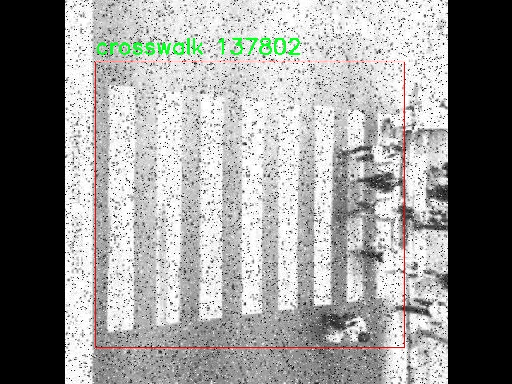
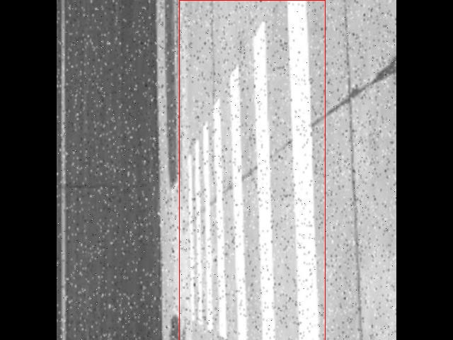

# 城市交通标线检测检测系统源码分享
 # [一条龙教学YOLOV8标注好的数据集一键训练_70+全套改进创新点发刊_Web前端展示]

### 1.研究背景与意义

项目参考[AAAI Association for the Advancement of Artificial Intelligence](https://gitee.com/qunshansj/projects)

项目来源[AACV Association for the Advancement of Computer Vision](https://gitee.com/qunmasj/projects)

研究背景与意义

随着城市化进程的加快，城市交通管理面临着越来越多的挑战。交通标线作为道路交通管理的重要组成部分，承担着引导车辆和行人安全通行的职责。然而，传统的交通标线检测方法往往依赖人工巡查，不仅效率低下，而且容易受到人为因素的影响，导致漏检和误检现象频繁发生。因此，开发一种高效、准确的自动化交通标线检测系统显得尤为重要。

近年来，深度学习技术的迅猛发展为计算机视觉领域带来了革命性的变化，尤其是在目标检测任务中，基于卷积神经网络（CNN）的模型表现出了优异的性能。YOLO（You Only Look Once）系列模型因其实时性和高准确率，成为目标检测领域的研究热点。YOLOv8作为该系列的最新版本，进一步提升了检测精度和速度，适用于复杂的城市交通环境。然而，现有的YOLOv8模型在城市交通标线检测方面仍存在一定的局限性，尤其是在多类标线的识别和复杂背景下的检测效果。

本研究旨在基于改进的YOLOv8模型，构建一个高效的城市交通标线检测系统。为此，我们将利用一个包含3400张图像的数据集，该数据集涵盖了四类交通标线：人行横道（crosswalk）、路缘带（curb）、行驶标志（go-block）和停车标志（stop-block）。这些标线在城市交通中具有重要的指引作用，准确的检测和识别将直接影响交通安全和交通流畅性。通过对数据集的深入分析与处理，我们将针对不同标线的特征进行模型优化，以提高检测的准确性和鲁棒性。

本研究的意义不仅在于技术层面的创新，更在于其对城市交通管理的实际应用价值。通过实现高效的交通标线检测，能够为交通管理部门提供实时、准确的交通标线信息，进而优化交通信号控制，减少交通事故的发生。此外，该系统还可以为智能交通系统的建设提供重要的数据支持，助力城市交通的智能化、自动化发展。

综上所述，基于改进YOLOv8的城市交通标线检测系统的研究，不仅具有重要的理论意义，还具有广泛的应用前景。随着城市交通环境的日益复杂，开发高效的交通标线检测技术将为提升城市交通管理水平、保障交通安全提供强有力的技术支撑。通过本研究的开展，我们希望能够为城市交通的智能化管理提供新的思路和解决方案，推动相关领域的进一步发展。

### 2.图片演示







##### 注意：由于此博客编辑较早，上面“2.图片演示”和“3.视频演示”展示的系统图片或者视频可能为老版本，新版本在老版本的基础上升级如下：（实际效果以升级的新版本为准）

  （1）适配了YOLOV8的“目标检测”模型和“实例分割”模型，通过加载相应的权重（.pt）文件即可自适应加载模型。

  （2）支持“图片识别”、“视频识别”、“摄像头实时识别”三种识别模式。

  （3）支持“图片识别”、“视频识别”、“摄像头实时识别”三种识别结果保存导出，解决手动导出（容易卡顿出现爆内存）存在的问题，识别完自动保存结果并导出到tempDir中。

  （4）支持Web前端系统中的标题、背景图等自定义修改，后面提供修改教程。

  另外本项目提供训练的数据集和训练教程,暂不提供权重文件（best.pt）,需要您按照教程进行训练后实现图片演示和Web前端界面演示的效果。

### 3.视频演示

[3.1 视频演示](https://www.bilibili.com/video/BV1s2tAejEHM/)

### 4.数据集信息展示

##### 4.1 本项目数据集详细数据（类别数＆类别名）

nc: 4
names: ['crosswalk', 'curb', 'go-block', 'stop-block']


##### 4.2 本项目数据集信息介绍

数据集信息展示

在城市交通标线检测系统的研究中，数据集的选择和构建至关重要。本研究所采用的数据集名为“Detection2”，该数据集专门设计用于训练和改进YOLOv8模型，以提高其在城市环境中对交通标线的检测能力。随着城市化进程的加快，交通管理面临着越来越多的挑战，准确识别和理解交通标线对于确保交通安全和提高交通效率具有重要意义。因此，Detection2数据集的构建不仅是技术上的需求，更是社会发展的必然。

Detection2数据集包含四个主要类别，分别是“人行横道（crosswalk）”、“路缘石（curb）”、“行驶块（go-block）”和“停车块（stop-block）”。这些类别涵盖了城市交通标线的关键元素，每个类别在交通管理和行车安全中扮演着不可或缺的角色。人行横道是行人过马路的重要标识，确保行人安全通行；路缘石则是道路边界的指示，帮助车辆保持在安全的行驶轨道上；行驶块和停车块则是对车辆行驶和停车行为的明确指引，避免交通混乱和事故的发生。

在数据集的构建过程中，研究团队对每个类别进行了细致的标注和分类，确保数据的准确性和多样性。数据集中的图像来源于不同的城市环境，涵盖了各种天气条件和光照变化，以增强模型的鲁棒性。通过这种多样化的图像采集，Detection2不仅能够反映现实世界中交通标线的复杂性，还能为YOLOv8模型的训练提供丰富的样本，从而提高其在实际应用中的表现。

此外，Detection2数据集还注重数据的平衡性，确保每个类别的样本数量相对均衡。这种设计旨在避免模型在训练过程中对某一类别的偏向，从而提高整体检测的准确性和可靠性。通过使用高质量的标注工具和严格的审核流程，研究团队确保了数据集的标注质量，使得每个图像中的交通标线都得到了准确的识别和定位。

在训练YOLOv8模型时，Detection2数据集的应用将极大地提升模型的性能。YOLOv8作为一种先进的目标检测算法，具有高效的实时检测能力和优越的准确性，而Detection2数据集则为其提供了坚实的基础。通过对数据集的充分利用，研究团队希望能够实现更高效的交通标线检测系统，为智能交通管理提供技术支持。

总之，Detection2数据集不仅是本研究的核心组成部分，更是推动城市交通安全和管理智能化的重要工具。通过对交通标线的深入研究和准确检测，未来的城市交通将更加安全、有序，为市民的出行提供更好的保障。











### 5.全套项目环境部署视频教程（零基础手把手教学）

[5.1 环境部署教程链接（零基础手把手教学）](https://www.ixigua.com/7404473917358506534?logTag=c807d0cbc21c0ef59de5)


[5.2 安装Python虚拟环境创建和依赖库安装视频教程链接（零基础手把手教学）](https://www.ixigua.com/7404474678003106304?logTag=1f1041108cd1f708b01a)

### 6.手把手YOLOV8训练视频教程（零基础小白有手就能学会）

[6.1 手把手YOLOV8训练视频教程（零基础小白有手就能学会）](https://www.ixigua.com/7404477157818401292?logTag=d31a2dfd1983c9668658)

### 7.70+种全套YOLOV8创新点代码加载调参视频教程（一键加载写好的改进模型的配置文件）

[7.1 70+种全套YOLOV8创新点代码加载调参视频教程（一键加载写好的改进模型的配置文件）](https://www.ixigua.com/7404478314661806627?logTag=29066f8288e3f4eea3a4)

### 8.70+种全套YOLOV8创新点原理讲解（非科班也可以轻松写刊发刊，V10版本正在科研待更新）

由于篇幅限制，每个创新点的具体原理讲解就不一一展开，具体见下列网址中的创新点对应子项目的技术原理博客网址【Blog】：


[8.1 70+种全套YOLOV8创新点原理讲解链接](https://gitee.com/qunmasj/good)

### 9.系统功能展示（检测对象为举例，实际内容以本项目数据集为准）

图9.1.系统支持检测结果表格显示

  图9.2.系统支持置信度和IOU阈值手动调节

  图9.3.系统支持自定义加载权重文件best.pt(需要你通过步骤5中训练获得)

  图9.4.系统支持摄像头实时识别

  图9.5.系统支持图片识别

  图9.6.系统支持视频识别

  图9.7.系统支持识别结果文件自动保存

  图9.8.系统支持Excel导出检测结果数据


### 10.原始YOLOV8算法原理

原始YOLOv8算法原理

YOLOv8算法是由Ultralytics团队在2023年1月发布的最新目标检测模型，基于YOLOv5的成功经验，结合了过去两年半内在实际应用中验证的多项改进。YOLOv8的设计理念是追求速度、准确性和易用性，使其在目标检测、图像分割和图像分类等任务中表现出色。该模型在结构上保持了YOLO系列的一贯特征，但在多个方面进行了重要的创新和优化。

首先，YOLOv8在输入图像处理上引入了自适应缩放机制。默认情况下，YOLOv8接受640x640像素的输入图像，但在实际应用中，图像的长宽比往往各不相同。为了提高检测速度和准确性，YOLOv8采用了一种自适应的缩放策略：将较长的一边按比例缩小到指定尺寸，然后对缩小后的短边进行填充。这种方法不仅减少了信息冗余，还提高了模型对不同尺寸图像的适应能力。此外，YOLOv8在训练过程中使用了Mosaic数据增强技术，以增强模型的鲁棒性和泛化能力。然而，为了避免数据分布的破坏，YOLOv8在训练的最后10个epoch中停止使用Mosaic增强，从而确保模型能够学习到更真实的数据特征。

在网络结构方面，YOLOv8的主干网络（Backbone）进行了显著的改进。YOLOv8将YOLOv5中的C3模块替换为C2f模块，后者借鉴了YOLOv7中的ELAN设计思路，增加了更多的跳层连接。这种设计使得C2f模块能够获得更丰富的梯度流信息，同时保持了模型的轻量化。C2f模块通过并行的梯度流分支，提升了特征提取的能力，进而提高了模型的精度和推理速度。此外，YOLOv8仍然保留了SPPF模块，这一模块在不影响效果的前提下，显著减少了执行时间。

在颈部网络（Neck）中，YOLOv8同样进行了优化。所有的C3模块被替换为C2f模块，并且去除了两处上采样之前的卷积连接层。这一变化使得不同阶段输出的特征能够更直接地进行上采样，从而提高了特征融合的效率。

YOLOv8的头部网络（Head）是其最大的创新之一。该模型采用了解耦头（Decoupled Head）结构，分别通过两条并行的分支提取类别和位置特征。这种解耦设计使得分类任务能够更专注于特征图中提取到的特征与已有类别的相似性，而定位任务则更加关注边界框与真实框之间的位置关系。这种侧重点的不同使得模型在收敛速度和预测精度上都有了显著提升。

在损失函数的设计上，YOLOv8引入了无锚框（Anchor-Free）检测方法，直接预测目标的中心位置。这一方法摒弃了传统的基于锚框的检测方式，避免了预设锚框的复杂性和灵活性不足的问题。YOLOv8通过任务对齐学习（Task Alignment Learning，TAL）来区分正负样本，并引入了分类分数和IOU的高次幂乘积作为衡量任务对齐程度的指标。这一创新使得模型在同时优化定位和分类的性能时，能够更有效地聚焦于标签附近的数值，提高了模型的整体性能。

在性能方面，YOLOv8在COCO数据集上的表现优于以往的YOLO系列模型，尤其是在相同尺寸下，YOLOv8在参数数量没有显著增加的情况下，取得了更高的精度和更快的推理速度。这使得YOLOv8在实时性和准确性兼顾的应用场景中，尤其适合用于如机器人垃圾分拣系统等需要快速反应的任务。

总的来说，YOLOv8算法通过一系列的结构优化和创新，显著提升了目标检测的性能和效率。其自适应输入处理、改进的主干网络、解耦头结构以及无锚框检测方法，均为YOLOv8在实际应用中提供了强大的支持。作为YOLO系列的最新版本，YOLOv8不仅在学术研究中具有重要的价值，也在工业应用中展现出广泛的前景。


### 11.项目核心源码讲解（再也不用担心看不懂代码逻辑）

#### 11.1 ui.py

以下是经过精简和注释的核心代码：

```python
import sys
import subprocess
from QtFusion.path import abs_path

def run_script(script_path):
    """
    使用当前 Python 环境运行指定的脚本。

    Args:
        script_path (str): 要运行的脚本路径
    """
    # 获取当前 Python 解释器的路径
    python_path = sys.executable

    # 构建运行命令，使用 streamlit 运行指定的脚本
    command = f'"{python_path}" -m streamlit run "{script_path}"'

    # 执行命令，并检查返回结果
    result = subprocess.run(command, shell=True)
    if result.returncode != 0:
        print("脚本运行出错。")

# 主程序入口
if __name__ == "__main__":
    # 获取脚本的绝对路径
    script_path = abs_path("web.py")

    # 运行指定的脚本
    run_script(script_path)
```

### 代码详细注释：
1. **导入模块**：
   - `sys`：用于访问与 Python 解释器相关的变量和函数。
   - `subprocess`：用于创建新进程、连接到它们的输入/输出/错误管道，并获取返回码。
   - `abs_path`：从 `QtFusion.path` 导入的函数，用于获取文件的绝对路径。

2. **定义 `run_script` 函数**：
   - 该函数接收一个脚本路径作为参数，并使用当前 Python 环境来运行该脚本。
   - 使用 `sys.executable` 获取当前 Python 解释器的路径。
   - 构建命令字符串，使用 `streamlit` 模块运行指定的脚本。
   - 使用 `subprocess.run` 执行命令，并通过 `returncode` 检查命令是否成功执行。

3. **主程序入口**：
   - 使用 `if __name__ == "__main__":` 确保只有在直接运行该脚本时才会执行以下代码。
   - 调用 `abs_path` 函数获取 `web.py` 的绝对路径。
   - 调用 `run_script` 函数来运行指定的脚本。

这个文件名为 `ui.py`，其主要功能是通过当前的 Python 环境来运行一个指定的脚本，具体是使用 Streamlit 框架来启动一个 Web 应用。

首先，文件导入了几个必要的模块，包括 `sys`、`os` 和 `subprocess`。其中，`sys` 模块用于访问与 Python 解释器相关的变量和函数，`os` 模块提供了与操作系统交互的功能，而 `subprocess` 模块则用于生成新的进程、连接到它们的输入/输出/错误管道，并获取它们的返回码。

接下来，文件中定义了一个名为 `run_script` 的函数。这个函数接受一个参数 `script_path`，它是要运行的脚本的路径。函数内部首先获取当前 Python 解释器的路径，并将其存储在 `python_path` 变量中。然后，构建一个命令字符串 `command`，这个命令会使用当前的 Python 解释器和 Streamlit 模块来运行指定的脚本。

使用 `subprocess.run` 方法执行这个命令，`shell=True` 参数允许在 shell 中执行命令。执行后，函数会检查返回码，如果返回码不为零，表示脚本运行出错，程序会打印出相应的错误信息。

在文件的最后部分，使用 `if __name__ == "__main__":` 语句来确保只有在直接运行该文件时才会执行以下代码。这里指定了要运行的脚本路径 `script_path`，它通过调用 `abs_path` 函数来获取 `web.py` 的绝对路径。最后，调用 `run_script` 函数来执行这个脚本。

总的来说，这个 `ui.py` 文件的作用是为一个 Streamlit 应用提供一个启动器，通过指定的脚本路径来运行 Web 应用。

#### 11.2 code\ultralytics\assets\utils\__init__.py

以下是代码中最核心的部分，并附上详细的中文注释：

```python
from sys import version_info as py_version  # 导入Python版本信息

def __pyarmor__():  # 定义一个名为__pyarmor__的函数
    import platform  # 导入platform模块，用于获取系统信息
    import sys  # 导入sys模块，用于访问Python解释器的变量和函数
    from struct import calcsize  # 从struct模块导入calcsize函数，用于计算数据类型的字节大小

    def format_system():  # 定义一个内部函数，用于格式化系统信息
        plat = platform.system().lower()  # 获取操作系统名称并转换为小写
        # 根据不同的操作系统名称进行处理
        plat = ('windows' if plat.startswith('cygwin') else
                'linux' if plat.startswith('linux') else
                'freebsd' if plat.startswith(
                    ('freebsd', 'openbsd', 'isilon onefs')) else plat)
        if plat == 'linux':  # 如果操作系统是Linux
            if hasattr(sys, 'getandroidapilevel'):  # 检查是否为Android
                plat = 'android'
            else:
                cname, cver = platform.libc_ver()  # 获取C库的名称和版本
                if cname == 'musl':  # 如果是musl C库
                    plat = 'alpine'  # 设置平台为alpine
                elif cname == 'libc':  # 如果是标准libc
                    plat = 'android'  # 设置平台为android
        return plat  # 返回处理后的平台名称

    def format_machine():  # 定义一个内部函数，用于格式化机器架构信息
        mach = platform.machine().lower()  # 获取机器架构名称并转换为小写
        # 定义一个架构映射表
        arch_table = (
            ('x86', ('i386', 'i486', 'i586', 'i686')),
            ('x86_64', ('x64', 'x86_64', 'amd64', 'intel')),
            ('arm', ('armv5',)),
            ('armv6', ('armv6l',)),
            ('armv7', ('armv7l',)),
            ('aarch32', ('aarch32',)),
            ('aarch64', ('aarch64', 'arm64'))
        )
        # 遍历架构映射表，查找匹配的架构
        for alias, archlist in arch_table:
            if mach in archlist:  # 如果当前架构在映射表中
                mach = alias  # 将架构名称替换为别名
                break
        return mach  # 返回处理后的机器架构名称

    plat, mach = format_system(), format_machine()  # 获取平台和机器架构信息
    # 如果操作系统是Windows且机器架构是x86_64
    if plat == 'windows' and mach == 'x86_64':
        bitness = calcsize('P'.encode()) * 8  # 计算指针的位数
        if bitness == 32:  # 如果位数为32位
            mach = 'x86'  # 将机器架构设置为x86
    # 生成模块名称，包含Python版本、平台和机器架构信息
    name = '.'.join(['py%d%d' % py_version[:2], '_'.join([plat, mach]), 'pyarmor_runtime'])
    # 动态导入生成的模块名称
    return __import__(name, globals(), locals(), ['__pyarmor__'], level=1)

__pyarmor__ = __pyarmor__().__pyarmor__  # 调用__pyarmor__函数并将返回值赋给__pyarmor__
```

### 代码功能概述：
1. **获取系统信息**：通过`platform`模块获取操作系统和机器架构的信息。
2. **处理平台名称**：根据操作系统的不同，格式化为统一的名称（如将Cygwin视为Windows）。
3. **处理机器架构**：根据机器架构的不同，将其映射为简化的名称（如将x86_64映射为x86_64）。
4. **动态导入模块**：根据Python版本、平台和机器架构动态生成模块名称并导入相应的模块。

这个程序文件是一个Python模块的初始化文件，主要用于根据当前运行环境的系统和机器架构信息动态导入一个特定的模块。文件的核心功能是通过获取系统和机器的相关信息，构建一个模块名称，然后导入这个模块。

首先，程序通过`from sys import version_info as py_version`导入了Python的版本信息，便于后续使用。

接下来，定义了一个名为`__pyarmor__`的函数。这个函数内部首先导入了`platform`、`sys`和`struct`模块。`platform`模块用于获取操作系统和机器架构的信息，`sys`模块用于访问与Python解释器相关的变量和函数，`struct`模块则用于计算数据的大小。

在`__pyarmor__`函数中，定义了两个内部函数：`format_system`和`format_machine`。`format_system`函数用于确定当前操作系统的类型，支持Windows、Linux、FreeBSD等系统，并且对Android和Alpine Linux进行了特殊处理。`format_machine`函数则用于确定当前机器的架构类型，包括x86、x86_64、ARM等。

接着，调用这两个函数，获取当前系统的类型和机器的架构，并将其分别存储在`plat`和`mach`变量中。如果当前操作系统是Windows且机器架构是x86_64，则通过`calcsize`函数计算位数，进一步判断并可能将架构调整为x86。

然后，程序构建了一个模块名称，格式为`py{major}{minor}_{plat}_{mach}_pyarmor_runtime`，其中`{major}`和`{minor}`是Python的主版本号和次版本号，`{plat}`和`{mach}`是之前获取的系统和机器信息。

最后，使用`__import__`函数动态导入构建好的模块名称，并返回这个模块中的`__pyarmor__`对象。这样做的目的是为了在运行时根据不同的环境加载相应的功能模块，增强了程序的灵活性和适应性。

#### 11.3 70+种YOLOv8算法改进源码大全和调试加载训练教程（非必要）\ultralytics\nn\extra_modules\dynamic_snake_conv.py

以下是经过简化和注释的核心代码部分，保留了主要功能和结构：

```python
import torch
import torch.nn as nn

class DySnakeConv(nn.Module):
    def __init__(self, inc, ouc, k=3) -> None:
        """
        动态蛇形卷积的初始化
        :param inc: 输入通道数
        :param ouc: 输出通道数
        :param k: 卷积核大小
        """
        super().__init__()
        
        # 定义标准卷积和两个方向的DSConv
        self.conv_0 = Conv(inc, ouc, k)  # 标准卷积
        self.conv_x = DSConv(inc, ouc, 0, k)  # 沿x轴的DSConv
        self.conv_y = DSConv(inc, ouc, 1, k)  # 沿y轴的DSConv
    
    def forward(self, x):
        """
        前向传播
        :param x: 输入特征图
        :return: 拼接后的输出特征图
        """
        # 将三个卷积的输出在通道维度上拼接
        return torch.cat([self.conv_0(x), self.conv_x(x), self.conv_y(x)], dim=1)

class DSConv(nn.Module):
    def __init__(self, in_ch, out_ch, morph, kernel_size=3, if_offset=True, extend_scope=1):
        """
        动态蛇形卷积的初始化
        :param in_ch: 输入通道数
        :param out_ch: 输出通道数
        :param morph: 卷积核的形态（0: x轴，1: y轴）
        :param kernel_size: 卷积核大小
        :param if_offset: 是否需要偏移
        :param extend_scope: 扩展范围
        """
        super(DSConv, self).__init__()
        # 用于学习可变形偏移的卷积
        self.offset_conv = nn.Conv2d(in_ch, 2 * kernel_size, 3, padding=1)
        self.bn = nn.BatchNorm2d(2 * kernel_size)
        self.kernel_size = kernel_size

        # 定义沿x轴和y轴的DSConv
        self.dsc_conv_x = nn.Conv2d(in_ch, out_ch, kernel_size=(kernel_size, 1), stride=(kernel_size, 1), padding=0)
        self.dsc_conv_y = nn.Conv2d(in_ch, out_ch, kernel_size=(1, kernel_size), stride=(1, kernel_size), padding=0)

        self.gn = nn.GroupNorm(out_ch // 4, out_ch)  # 组归一化
        self.act = Conv.default_act  # 默认激活函数

        self.extend_scope = extend_scope
        self.morph = morph
        self.if_offset = if_offset

    def forward(self, f):
        """
        前向传播
        :param f: 输入特征图
        :return: 经过DSConv处理后的特征图
        """
        # 计算偏移
        offset = self.offset_conv(f)
        offset = self.bn(offset)
        offset = torch.tanh(offset)  # 将偏移限制在[-1, 1]之间

        # 获取输入特征图的形状
        input_shape = f.shape
        dsc = DSC(input_shape, self.kernel_size, self.extend_scope, self.morph)  # 初始化DSC
        deformed_feature = dsc.deform_conv(f, offset, self.if_offset)  # 进行可变形卷积

        # 根据形态选择不同的卷积操作
        if self.morph == 0:
            x = self.dsc_conv_x(deformed_feature.type(f.dtype))
        else:
            x = self.dsc_conv_y(deformed_feature.type(f.dtype))
        
        x = self.gn(x)  # 归一化
        x = self.act(x)  # 激活
        return x

class DSC(object):
    def __init__(self, input_shape, kernel_size, extend_scope, morph):
        """
        动态蛇形卷积的坐标映射和双线性插值
        :param input_shape: 输入特征图的形状
        :param kernel_size: 卷积核大小
        :param extend_scope: 扩展范围
        :param morph: 卷积核的形态
        """
        self.num_points = kernel_size
        self.width = input_shape[2]
        self.height = input_shape[3]
        self.morph = morph
        self.extend_scope = extend_scope

        # 定义特征图的形状
        self.num_batch = input_shape[0]
        self.num_channels = input_shape[1]

    def deform_conv(self, input, offset, if_offset):
        """
        进行可变形卷积
        :param input: 输入特征图
        :param offset: 偏移量
        :param if_offset: 是否使用偏移
        :return: 变形后的特征图
        """
        y, x = self._coordinate_map_3D(offset, if_offset)  # 计算坐标映射
        deformed_feature = self._bilinear_interpolate_3D(input, y, x)  # 进行双线性插值
        return deformed_feature

    # 省略其他辅助函数以简化代码
```

### 代码说明：
1. **DySnakeConv** 类是动态蛇形卷积的主要实现，包含标准卷积和两个方向的DSConv。
2. **DSConv** 类实现了动态蛇形卷积的核心逻辑，包括偏移的学习和应用。
3. **DSC** 类负责计算坐标映射和进行双线性插值，以实现特征图的变形。
4. 代码中省略了一些辅助函数以保持简洁，但核心功能得以保留。

这个程序文件实现了动态蛇形卷积（Dynamic Snake Convolution），它是深度学习中一种改进的卷积操作，主要用于处理图像数据。文件中定义了两个主要的类：`DySnakeConv`和`DSConv`，以及一个辅助类`DSC`。

在`DySnakeConv`类中，构造函数接受输入通道数`inc`、输出通道数`ouc`和卷积核大小`k`作为参数。它初始化了三个卷积层：`conv_0`是标准卷积，`conv_x`和`conv_y`是动态蛇形卷积，分别沿着x轴和y轴进行操作。在前向传播方法中，输入`x`通过这三个卷积层处理后，结果在通道维度上进行拼接。

`DSConv`类实现了动态蛇形卷积的具体逻辑。构造函数中，`offset_conv`用于学习可变形的偏移量，`dsc_conv_x`和`dsc_conv_y`分别是沿x轴和y轴的卷积操作。`forward`方法中，首先通过`offset_conv`计算偏移量，然后使用`DSC`类中的方法进行变形卷积操作，最后根据不同的形态（morph）选择相应的卷积层进行处理。

`DSC`类负责生成坐标映射和进行双线性插值。它的`_coordinate_map_3D`方法根据输入的偏移量生成新的坐标，`_bilinear_interpolate_3D`方法则根据这些坐标对输入特征图进行插值，得到变形后的特征图。这个过程允许卷积核在图像上进行灵活的变形，从而更好地捕捉图像中的特征。

总体来说，这段代码实现了一种新型的卷积操作，通过动态调整卷积核的位置和形状，增强了卷积神经网络在图像处理任务中的表现。

#### 11.4 70+种YOLOv8算法改进源码大全和调试加载训练教程（非必要）\ultralytics\hub\auth.py

以下是代码中最核心的部分，并附上详细的中文注释：

```python
import requests

class Auth:
    """
    处理身份验证过程，包括API密钥处理、基于cookie的身份验证和头部生成。

    支持不同的身份验证方法：
    1. 直接使用API密钥。
    2. 使用浏览器cookie进行身份验证（特别是在Google Colab中）。
    3. 提示用户输入API密钥。
    """
    id_token = api_key = model_key = False  # 初始化身份验证相关的属性

    def __init__(self, api_key='', verbose=False):
        """
        初始化Auth类，可以选择性地传入API密钥。

        参数:
            api_key (str, optional): API密钥或组合的API密钥和模型ID
        """
        # 分割输入的API密钥，以防包含组合的key_model，仅保留API密钥部分
        api_key = api_key.split('_')[0]

        # 设置API密钥属性，如果没有传入则使用设置中的API密钥
        self.api_key = api_key or SETTINGS.get('api_key', '')

        # 如果提供了API密钥
        if self.api_key:
            # 检查提供的API密钥是否与设置中的API密钥匹配
            if self.api_key == SETTINGS.get('api_key'):
                # 记录用户已登录
                if verbose:
                    LOGGER.info(f'{PREFIX}Authenticated ✅')
                return
            else:
                # 尝试使用提供的API密钥进行身份验证
                success = self.authenticate()
        # 如果没有提供API密钥且环境为Google Colab
        elif is_colab():
            # 尝试使用浏览器cookie进行身份验证
            success = self.auth_with_cookies()
        else:
            # 请求用户输入API密钥
            success = self.request_api_key()

        # 如果身份验证成功，更新设置中的API密钥
        if success:
            SETTINGS.update({'api_key': self.api_key})
            if verbose:
                LOGGER.info(f'{PREFIX}New authentication successful ✅')
        elif verbose:
            LOGGER.info(f'{PREFIX}Retrieve API key from {API_KEY_URL}')

    def authenticate(self) -> bool:
        """
        尝试使用id_token或API密钥进行服务器身份验证。

        返回:
            bool: 如果身份验证成功则返回True，否则返回False。
        """
        try:
            header = self.get_auth_header()  # 获取身份验证头部
            if header:
                r = requests.post(f'{HUB_API_ROOT}/v1/auth', headers=header)  # 发送身份验证请求
                if not r.json().get('success', False):
                    raise ConnectionError('Unable to authenticate.')  # 身份验证失败
                return True
            raise ConnectionError('User has not authenticated locally.')  # 本地未进行身份验证
        except ConnectionError:
            self.id_token = self.api_key = False  # 重置无效的身份验证信息
            LOGGER.warning(f'{PREFIX}Invalid API key ⚠️')  # 记录无效的API密钥
            return False

    def get_auth_header(self):
        """
        获取用于API请求的身份验证头部。

        返回:
            (dict): 如果设置了id_token或API密钥，则返回身份验证头部，否则返回None。
        """
        if self.id_token:
            return {'authorization': f'Bearer {self.id_token}'}  # 使用id_token生成头部
        elif self.api_key:
            return {'x-api-key': self.api_key}  # 使用API密钥生成头部
        return None  # 否则返回None
```

### 代码核心部分解释：
1. **Auth类**：负责处理身份验证，包括API密钥和cookie的管理。
2. **`__init__`方法**：初始化Auth类，处理API密钥的传入和验证。
3. **`authenticate`方法**：通过API密钥或id_token尝试进行身份验证，并返回验证结果。
4. **`get_auth_header`方法**：根据是否有id_token或API密钥生成相应的身份验证头部，以便在API请求中使用。

这个程序文件是一个用于管理身份验证的类，名为 `Auth`，它是 Ultralytics YOLO 项目的一部分，主要用于处理 API 密钥、基于 Cookie 的身份验证以及生成请求头。文件中包含了一些重要的功能和属性，以下是对代码的详细说明。

首先，文件导入了一些必要的库和模块，包括 `requests` 用于发送 HTTP 请求，以及一些来自 `ultralytics` 的工具和设置。接着，定义了一个 `Auth` 类，该类的主要职责是处理与身份验证相关的操作。

在类的文档字符串中，清晰地描述了该类的功能，包括支持三种身份验证方式：直接使用 API 密钥、使用浏览器 Cookie 进行身份验证（特别是在 Google Colab 中），以及提示用户输入 API 密钥。类中定义了三个属性：`id_token`、`api_key` 和 `model_key`，它们都初始化为 `False`，用于存储身份验证所需的信息。

构造函数 `__init__` 接受一个可选的 API 密钥参数。它首先处理输入的 API 密钥，确保只保留 API 密钥部分。如果提供了 API 密钥，程序会检查该密钥是否与设置中的密钥匹配。如果匹配，则记录用户已登录的信息；如果不匹配，则尝试使用提供的 API 密钥进行身份验证。如果没有提供 API 密钥且当前环境是 Google Colab，程序会尝试通过浏览器 Cookie 进行身份验证；否则，它会请求用户输入 API 密钥。

`request_api_key` 方法用于提示用户输入 API 密钥，最多允许三次尝试。如果用户输入的密钥有效，则返回成功；否则抛出连接错误。

`authenticate` 方法尝试使用 `id_token` 或 API 密钥与服务器进行身份验证。如果成功，返回 `True`；否则，重置无效的身份验证信息并记录警告信息。

`auth_with_cookies` 方法专门用于在 Google Colab 环境中通过 Cookie 进行身份验证。如果成功获取到身份验证信息，则调用 `authenticate` 方法进行进一步验证。

最后，`get_auth_header` 方法用于生成用于 API 请求的身份验证头。如果存在有效的 `id_token` 或 API 密钥，则返回相应的头部信息；否则返回 `None`。

整体来看，这个文件实现了一个灵活的身份验证机制，支持多种方式来确保用户能够安全地访问 Ultralytics YOLO 的 API。

#### 11.5 code\ultralytics\models\yolo\segment\val.py

以下是经过简化和注释的核心代码部分，主要关注于`SegmentationValidator`类的关键功能和流程：

```python
# 导入必要的库
from ultralytics.models.yolo.detect import DetectionValidator
from ultralytics.utils import ops
import torch
import numpy as np

class SegmentationValidator(DetectionValidator):
    """
    SegmentationValidator类用于基于分割模型的验证，继承自DetectionValidator。
    """

    def __init__(self, dataloader=None, save_dir=None, pbar=None, args=None, _callbacks=None):
        """初始化SegmentationValidator，设置任务为'segment'，并初始化评估指标。"""
        super().__init__(dataloader, save_dir, pbar, args, _callbacks)
        self.args.task = "segment"  # 设置任务类型为分割
        self.metrics = SegmentMetrics(save_dir=self.save_dir, on_plot=self.on_plot)  # 初始化分割指标

    def preprocess(self, batch):
        """预处理批次数据，将掩码转换为浮点型并发送到设备。"""
        batch = super().preprocess(batch)  # 调用父类的预处理方法
        batch["masks"] = batch["masks"].to(self.device).float()  # 将掩码转换为浮点型
        return batch

    def postprocess(self, preds):
        """后处理YOLO预测，返回输出检测结果和原型。"""
        p = ops.non_max_suppression(
            preds[0],
            self.args.conf,
            self.args.iou,
            labels=self.lb,
            multi_label=True,
            agnostic=self.args.single_cls,
            max_det=self.args.max_det,
            nc=self.nc,
        )  # 应用非极大值抑制
        proto = preds[1][-1] if len(preds[1]) == 3 else preds[1]  # 获取原型
        return p, proto

    def update_metrics(self, preds, batch):
        """更新评估指标。"""
        for si, (pred, proto) in enumerate(zip(preds[0], preds[1])):
            self.seen += 1  # 记录已处理的样本数量
            npr = len(pred)  # 当前预测的数量
            stat = dict(
                conf=torch.zeros(0, device=self.device),
                pred_cls=torch.zeros(0, device=self.device),
                tp=torch.zeros(npr, self.niou, dtype=torch.bool, device=self.device),
            )
            pbatch = self._prepare_batch(si, batch)  # 准备当前批次数据
            cls, bbox = pbatch.pop("cls"), pbatch.pop("bbox")  # 获取类和边界框
            nl = len(cls)  # 目标数量
            stat["target_cls"] = cls  # 记录目标类

            if npr == 0:  # 如果没有预测
                continue

            # 处理掩码
            gt_masks = pbatch.pop("masks")  # 获取真实掩码
            predn, pred_masks = self._prepare_pred(pred, pbatch, proto)  # 准备预测结果和掩码
            stat["conf"] = predn[:, 4]  # 置信度
            stat["pred_cls"] = predn[:, 5]  # 预测类

            if nl:  # 如果有目标
                stat["tp"] = self._process_batch(predn, bbox, cls)  # 处理边界框
                stat["tp_m"] = self._process_batch(predn, bbox, cls, pred_masks, gt_masks, self.args.overlap_mask, masks=True)  # 处理掩码

            for k in self.stats.keys():
                self.stats[k].append(stat[k])  # 更新统计信息

    def _process_batch(self, detections, gt_bboxes, gt_cls, pred_masks=None, gt_masks=None, overlap=False, masks=False):
        """
        返回正确的预测矩阵。
        """
        if masks:
            # 处理掩码的IoU计算
            iou = mask_iou(gt_masks.view(gt_masks.shape[0], -1), pred_masks.view(pred_masks.shape[0], -1))
        else:
            # 处理边界框的IoU计算
            iou = box_iou(gt_bboxes, detections[:, :4])

        return self.match_predictions(detections[:, 5], gt_cls, iou)  # 匹配预测与真实标签

    def plot_predictions(self, batch, preds, ni):
        """绘制批次预测结果，包括掩码和边界框。"""
        plot_images(
            batch["img"],
            *output_to_target(preds[0], max_det=15),  # 绘制预测结果
            torch.cat(self.plot_masks, dim=0) if len(self.plot_masks) else self.plot_masks,
            paths=batch["im_file"],
            fname=self.save_dir / f"val_batch{ni}_pred.jpg",
            names=self.names,
            on_plot=self.on_plot,
        )  # 保存绘制结果
        self.plot_masks.clear()  # 清空绘制掩码

```

### 代码注释说明
1. **类的初始化**：在`__init__`方法中，设置任务类型为分割，并初始化评估指标。
2. **数据预处理**：`preprocess`方法将输入批次中的掩码转换为浮点型，并移动到指定设备。
3. **后处理预测**：`postprocess`方法应用非极大值抑制来过滤预测结果，并提取原型。
4. **更新指标**：`update_metrics`方法用于更新模型的评估指标，包括处理边界框和掩码的IoU计算。
5. **绘制预测结果**：`plot_predictions`方法用于可视化模型的预测结果，包括掩码和边界框。

这些核心部分构成了分割模型验证的主要逻辑，确保模型的输出能够被有效评估和可视化。

这个程序文件是用于YOLO（You Only Look Once）模型的分割验证的实现，主要用于对分割模型的输出进行评估和验证。文件中定义了一个名为`SegmentationValidator`的类，它继承自`DetectionValidator`类，专门处理分割任务的验证过程。

在初始化方法中，`SegmentationValidator`设置了任务类型为“segment”，并初始化了一些与分割相关的指标和参数。它调用了父类的初始化方法，并准备了用于计算分割性能的`SegmentMetrics`对象。

`preprocess`方法负责对输入的批次数据进行预处理，将掩码数据转换为浮点型并移动到相应的设备上（如GPU）。`init_metrics`方法则根据是否需要保存JSON格式的结果来选择不同的掩码处理函数，并初始化用于统计的字典。

在`get_desc`方法中，返回了一个格式化的字符串，描述了评估指标的名称，包括图像数量、实例数量、框的精度和召回率等。

`postprocess`方法用于处理YOLO模型的预测结果，执行非极大值抑制（NMS）以去除冗余的检测框，并返回处理后的预测结果和原型数据。

`_prepare_batch`和`_prepare_pred`方法分别用于准备输入批次和预测结果，确保数据格式正确，适合后续的处理和评估。

`update_metrics`方法是核心部分，负责更新各种评估指标。它遍历每个预测结果，并与真实标签进行比较，计算真阳性、假阳性等指标。根据需要，它还会保存预测结果到JSON文件中。

`finalize_metrics`方法用于设置评估指标的速度和混淆矩阵，以便后续的分析。

`_process_batch`方法用于处理一批检测结果，计算与真实标签的交并比（IoU），并返回正确预测的矩阵。

`plot_val_samples`和`plot_predictions`方法用于可视化验证样本和预测结果，生成带有边界框和掩码的图像。

`pred_to_json`方法将预测结果保存为JSON格式，适用于COCO数据集的评估。它将预测的掩码编码为RLE格式，并将相关信息（如图像ID、类别ID、边界框和得分）添加到结果字典中。

最后，`eval_json`方法用于评估COCO格式的目标检测指标，利用pycocotools库计算mAP（平均精度均值）等指标，并返回更新后的统计信息。

总体来说，这个文件实现了YOLO分割模型的验证流程，包括数据预处理、模型预测、指标计算和结果可视化等功能，适用于图像分割任务的性能评估。

#### 11.6 train.py

以下是经过简化和注释的核心代码部分，主要保留了训练过程中的关键功能：

```python
import random
import numpy as np
import torch.nn as nn
from ultralytics.data import build_dataloader, build_yolo_dataset
from ultralytics.engine.trainer import BaseTrainer
from ultralytics.models import yolo
from ultralytics.nn.tasks import DetectionModel
from ultralytics.utils import LOGGER, RANK
from ultralytics.utils.torch_utils import de_parallel, torch_distributed_zero_first

class DetectionTrainer(BaseTrainer):
    """
    扩展自 BaseTrainer 类，用于基于检测模型的训练。
    """

    def build_dataset(self, img_path, mode="train", batch=None):
        """
        构建 YOLO 数据集。

        参数:
            img_path (str): 包含图像的文件夹路径。
            mode (str): 模式，可以是 'train' 或 'val'，用户可以为每种模式自定义不同的增强。
            batch (int, optional): 批次大小，适用于 'rect' 模式。默认为 None。
        """
        gs = max(int(de_parallel(self.model).stride.max() if self.model else 0), 32)
        return build_yolo_dataset(self.args, img_path, batch, self.data, mode=mode, rect=mode == "val", stride=gs)

    def get_dataloader(self, dataset_path, batch_size=16, rank=0, mode="train"):
        """构造并返回数据加载器。"""
        assert mode in ["train", "val"]
        with torch_distributed_zero_first(rank):  # 在 DDP 中仅初始化数据集 *.cache 一次
            dataset = self.build_dataset(dataset_path, mode, batch_size)
        shuffle = mode == "train"  # 训练模式下打乱数据
        workers = self.args.workers if mode == "train" else self.args.workers * 2
        return build_dataloader(dataset, batch_size, workers, shuffle, rank)  # 返回数据加载器

    def preprocess_batch(self, batch):
        """对一批图像进行预处理，包括缩放和转换为浮点数。"""
        batch["img"] = batch["img"].to(self.device, non_blocking=True).float() / 255  # 将图像转换为浮点数并归一化
        if self.args.multi_scale:  # 如果启用多尺度
            imgs = batch["img"]
            sz = (
                random.randrange(self.args.imgsz * 0.5, self.args.imgsz * 1.5 + self.stride)
                // self.stride
                * self.stride
            )  # 随机选择尺寸
            sf = sz / max(imgs.shape[2:])  # 计算缩放因子
            if sf != 1:
                ns = [
                    math.ceil(x * sf / self.stride) * self.stride for x in imgs.shape[2:]
                ]  # 计算新的形状
                imgs = nn.functional.interpolate(imgs, size=ns, mode="bilinear", align_corners=False)  # 调整图像大小
            batch["img"] = imgs
        return batch

    def get_model(self, cfg=None, weights=None, verbose=True):
        """返回 YOLO 检测模型。"""
        model = DetectionModel(cfg, nc=self.data["nc"], verbose=verbose and RANK == -1)
        if weights:
            model.load(weights)  # 加载权重
        return model

    def plot_training_samples(self, batch, ni):
        """绘制带有注释的训练样本。"""
        plot_images(
            images=batch["img"],
            batch_idx=batch["batch_idx"],
            cls=batch["cls"].squeeze(-1),
            bboxes=batch["bboxes"],
            paths=batch["im_file"],
            fname=self.save_dir / f"train_batch{ni}.jpg",
            on_plot=self.on_plot,
        )

    def plot_metrics(self):
        """从 CSV 文件中绘制指标。"""
        plot_results(file=self.csv, on_plot=self.on_plot)  # 保存结果图
```

### 代码说明：
1. **构建数据集**：`build_dataset` 方法用于根据给定的图像路径和模式（训练或验证）构建 YOLO 数据集，支持不同的增强策略。
2. **获取数据加载器**：`get_dataloader` 方法创建数据加载器，处理数据的批次大小和工作线程数量，并在训练模式下打乱数据。
3. **预处理批次**：`preprocess_batch` 方法对输入的图像批次进行预处理，包括归一化和可能的缩放，以适应不同的输入尺寸。
4. **获取模型**：`get_model` 方法返回一个 YOLO 检测模型，并可以选择性地加载预训练权重。
5. **绘制训练样本**：`plot_training_samples` 方法用于可视化训练样本及其注释，便于调试和分析。
6. **绘制指标**：`plot_metrics` 方法从 CSV 文件中绘制训练过程中的指标，以便于监控模型性能。

这个程序文件 `train.py` 是一个用于训练目标检测模型的实现，主要基于 YOLO（You Only Look Once）架构。文件中定义了一个名为 `DetectionTrainer` 的类，该类继承自 `BaseTrainer`，并专门用于处理目标检测任务。

在这个类中，首先定义了 `build_dataset` 方法，用于构建 YOLO 数据集。该方法接收图像路径、模式（训练或验证）和批量大小作为参数。它通过调用 `build_yolo_dataset` 函数来创建数据集，并根据模型的步幅（stride）进行调整。

接着，`get_dataloader` 方法用于构建数据加载器。该方法会根据模式（训练或验证）来设置数据集，并确保在分布式训练时只初始化一次数据集缓存。数据加载器的构建考虑了是否需要打乱数据、工作线程的数量等因素。

`preprocess_batch` 方法负责对输入的图像批次进行预处理，包括将图像缩放到合适的大小并转换为浮点数格式。它还支持多尺度训练，通过随机选择图像大小来增强模型的鲁棒性。

`set_model_attributes` 方法用于设置模型的属性，包括类别数量和类别名称。这些信息是从数据集中提取的，以确保模型能够正确识别目标。

`get_model` 方法用于返回一个 YOLO 检测模型的实例，可以选择加载预训练权重。`get_validator` 方法则返回一个用于模型验证的 `DetectionValidator` 实例。

`label_loss_items` 方法用于返回带有标签的训练损失项字典，这在目标检测任务中是必要的，因为它需要跟踪不同类型的损失（如边界框损失、类别损失等）。

`progress_string` 方法生成一个格式化的字符串，用于显示训练进度，包括当前的轮次、GPU 内存使用情况、损失值、实例数量和图像大小等信息。

`plot_training_samples` 方法用于绘制训练样本及其注释，便于可视化训练过程中的数据。`plot_metrics` 方法则用于从 CSV 文件中绘制训练指标，生成可视化结果。最后，`plot_training_labels` 方法创建一个带标签的训练图，显示模型在训练集上的表现。

总体而言，这个文件实现了一个完整的目标检测训练流程，包括数据集构建、数据加载、模型设置、训练过程监控和结果可视化等功能。

### 12.系统整体结构（节选）

### 整体功能和构架概括

该程序整体是一个基于 YOLO（You Only Look Once）架构的深度学习框架，主要用于目标检测、图像分割和姿态估计等任务。它包含了数据集的构建、模型的训练与验证、身份验证、动态卷积模块的实现以及可视化工具等多个方面。程序的架构清晰，功能模块化，便于扩展和维护。

- **数据处理**：通过自定义的数据集类和数据加载器，支持多种数据格式和增强策略。
- **模型训练**：实现了完整的训练流程，包括模型的初始化、损失计算、进度监控和可视化。
- **验证与评估**：提供了验证模块，能够计算模型在验证集上的性能指标，并支持结果的可视化。
- **身份验证**：实现了与API的身份验证机制，确保用户能够安全地访问模型服务。
- **动态卷积**：引入了动态蛇形卷积模块，增强了模型的特征提取能力。
- **可视化工具**：包括训练样本的可视化、指标绘制和图形用户界面（GUI）等功能。

### 文件功能整理表

| 文件路径                                                                                              | 功能描述                                                                                   |
|-----------------------------------------------------------------------------------------------------|------------------------------------------------------------------------------------------|
| `D:\tools\20240809\code\ui.py`                                                                      | 启动 Streamlit Web 应用，用于用户界面交互和模型运行。                                          |
| `D:\tools\20240809\code\code\ultralytics\assets\utils\__init__.py`                               | 动态导入特定模块，支持不同系统和架构的适配。                                               |
| `D:\tools\20240809\code\70+种YOLOv8算法改进源码大全和调试加载训练教程（非必要）\ultralytics\nn\extra_modules\dynamic_snake_conv.py` | 实现动态蛇形卷积（Dynamic Snake Convolution），增强卷积神经网络的特征提取能力。               |
| `D:\tools\20240809\code\70+种YOLOv8算法改进源码大全和调试加载训练教程（非必要）\ultralytics\hub\auth.py` | 管理身份验证，包括 API 密钥和 Cookie 验证，确保安全访问。                                  |
| `D:\tools\20240809\code\ultralytics\models\yolo\segment\val.py`                                   | 实现分割模型的验证流程，包括数据预处理、模型预测和性能指标计算。                            |
| `D:\tools\20240809\code\train.py`                                                                   | 处理目标检测模型的训练流程，包括数据集构建、模型初始化、损失计算和训练监控。                 |
| `D:\tools\20240809\code\70+种YOLOv8算法改进源码大全和调试加载训练教程（非必要）\ultralytics\utils\callbacks\hub.py` | 提供回调函数支持，用于训练过程中的事件处理和监控。                                          |
| `D:\tools\20240809\code\ultralytics\models\yolo\pose\__init__.py`                                 | 初始化姿态估计模块，设置相关属性和功能。                                                   |
| `D:\tools\20240809\code\ultralytics\data\explorer\gui\dash.py`                                    | 实现图形用户界面（GUI），用于数据集的可视化和交互操作。                                     |
| `D:\tools\20240809\code\70+种YOLOv8算法改进源码大全和调试加载训练教程（非必要）\ultralytics\models\sam\modules\sam.py` | 实现 SAM（Segment Anything Model）模块，支持图像分割功能。                                 |
| `D:\tools\20240809\code\ultralytics\models\sam\modules\sam.py`                                     | 同上，可能是重复的文件路径，提供相同的功能。                                                |
| `D:\tools\20240809\code\ultralytics\hub\session.py`                                               | 管理与 Ultralytics Hub 的会话，处理模型的上传和下载。                                       |
| `D:\tools\20240809\code\ultralytics\trackers\byte_tracker.py`                                     | 实现 Byte Tracker，用于目标跟踪任务，支持多目标跟踪和数据关联。                               |

这个表格整理了每个文件的主要功能，便于理解整个项目的结构和各个模块的职责。

注意：由于此博客编辑较早，上面“11.项目核心源码讲解（再也不用担心看不懂代码逻辑）”中部分代码可能会优化升级，仅供参考学习，完整“训练源码”、“Web前端界面”和“70+种创新点源码”以“13.完整训练+Web前端界面+70+种创新点源码、数据集获取”的内容为准。

### 13.完整训练+Web前端界面+70+种创新点源码、数据集获取


# [下载链接：https://mbd.pub/o/bread/ZpuVlJxq](https://mbd.pub/o/bread/ZpuVlJxq)